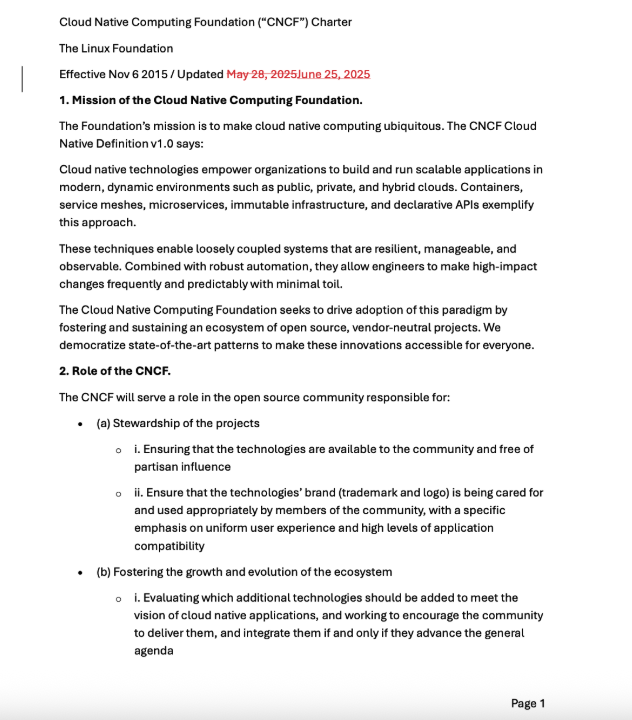
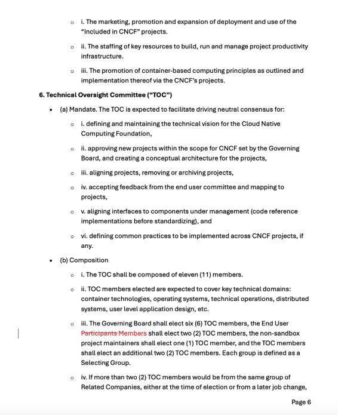
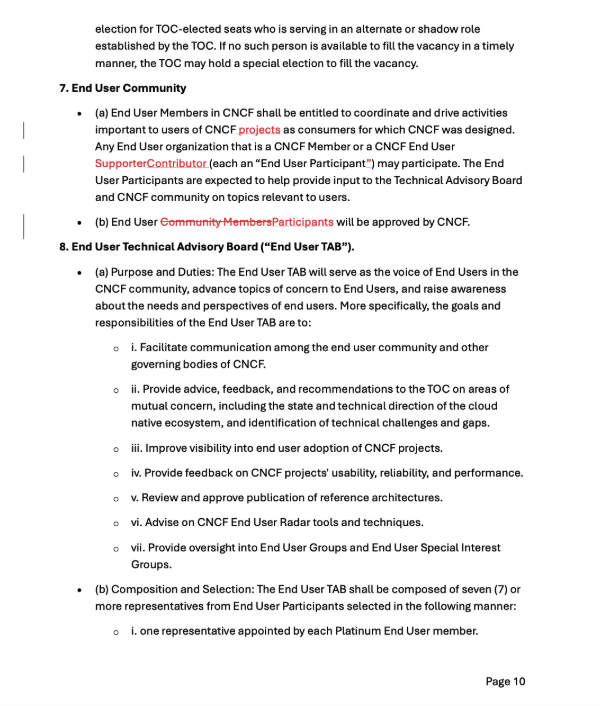
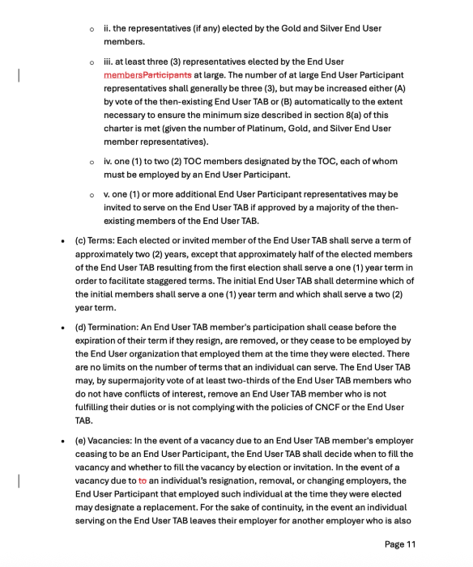

## **Cloud Native Computing Foundation**

Minutes of a meeting of the Governing Board

June 25, 2025

A meeting of the Governing Board of the Cloud Native Computing Foundation (“CNCF”), which is part of The Linux Foundation, was held on June 25, 2025, from 3:00 PM \- 4:30 PM MT in person in Denver, CO and via Zoom.

The following members of the Governing Board, constituting a quorum under the CNCF Charter, were present:

Alena Prokharchyk, Apple  
Jeremy Garcia, Datadog  
Justin Dustzadeh, Equinix  
Jan Melén, Ericsson  
Takao Indoh, Fujitsu  
April Kyle Nassi, Google  
Vish Abrams, Heroku  
Yuichi Nakamura, Hitachi  
Brian Che, Huawei (alternate)  
Arun Gupta, Intel, Chairperson  
Sebastian Scheele, Kubermatic  
Bridget Kromhout, Microsoft (alternate)  
Sudha Raghavan, Oracle  
Brad Topol, Red Hat/IBM (alternate)  
Alan Clark, SUSE (alternate)  
Craig Box, Developer Seat  
Christoph Blecker, Developer Seat  
Karena Angell, TOC Chair  
Ricardo Rocha, TAB Chair  

Also in attendance were:  

William Deniss, Google (alternate)  
Mario Fahlandt, Kubermatic (alternate)  
Davanum Srinivas, TOC  
Jeremy Rickard, TOC  
Chad Beaudin, TAB/TOC  
Ahmed Bebars, TAB  
Alolita Sharma, TAB  
Benjamin Somogyi, TAB  
Henrik Blixt, TAB  
Joseph Sandoval, TAB  
Jonathan Bryce, CNCF  
Chris Aniszczyk, CNCF  
Joanna Lee, CNCF  
Taylor Waggoner, CNCF  
Daniel Krook, CNCF  
Bob Killen, CNCF  
Angela Brown, The Linux Foundation  
Casey Robinson, The Linux Foundation  
Todd Moore, The Linux Foundation  

Mr. Moore called the meeting to order at 3:08 PM MT. He introduced Jonathan Bryce, CNCF’s new executive director and noted Chris Aniszczyk’s expanded role as CTO, Cloud & Infrastructure for the Linux Foundation.

He welcomed the board members to the call and thanked everyone for attending. Mr. Moore then reviewed the Linux Foundation Antitrust Policy Notice, confirmed that quorum was present, and reviewed the meeting agenda.

Mr. Moore welcomed the new Governing Board CNCF members and alternates. 

**Legal & Governance**  
Ms. Lee presented proposed amendments to the CNCF Charter related to the introduction of the CNCF End User Contributor program, launching in Q3-2025. The following resolution was unanimously approved:

**RESOLVED:** that the amendments to the CNCF Charter presented at the meeting and attached as Exhibit A are hereby approved and adopted.

Ms. Lee presented a resolution to allow OpenTelemetry use of public key encryption root certificates from the Common CA Database (CCADB), noting that the CNCF Legal Committee recommends approval.  The following resolution was unanimously approved:

**RESOLVED:** that an exception to allow OpenTelemetry’s use of public key encryption root certificates from the Common CA Database (CCADB), licensed under the Community Data License Agreement – Permissive, Version 2.0 (CDLA-Permissive-2.0) (Issue [\#1007](https://github.com/cncf/foundation/issues/1007)) is hereby approved.

**2025 Financials**  
Mr. Bryce reviewed the 2025 mid-year re-forecast of the CNCF budget.  

**Joint Meeting of the Governing Board, Technical Oversight Committee (TOC), and End User Technical Advisory Board (TAB)**  
*The CNCF TOC and TAB joined the meeting at 3:25 PM MT for a joint session of the Governing Board, TOC, and End User TAB*

**Project Updates**  
Mr. Aniszczyk reviewed project highlights so far this year, noting projects that recently moved levels and new Sandbox projects, as well as an overview of CNCF’s mentorship program.

Mr. Aniszczyk provided the history and an update on a recent dispute regarding the NATS project, noting a positive resolution to the situation as well as the strengthened collaboration between CNCF and Synadia.

A board member asked when the audit of current CNCF projects will be complete. Mr. Aniszczky noted that CNCF is conducting a comprehensive audit of all projects’ completion of their onboarding requirements, including the required assignment of trademarks. Ms. Lee noted that CNCF is doing this audit in phases along with the Series LLC restructuring, and it will likely take several months or more to complete. A board member asked CNCF to report to the board when it is complete and Mr. Aniszczyk agreed.

 A brief discussion ensued about supporting the NATS project with growing to meet the requirements for graduation.

A board member asked if Mr. Aniszczyk’s and Mr. Bryce’s combined roles will lead to more synergies between the OpenInfra Foundation and CNCF, such as combined large events or projects moving between foundations. Mr. Aniszczyk noted that it’s a bit too early to know. Mr. Bryce agreed and noted that there is a lot of overlap with various end users that would benefit from combined events, etc. 

**TOC Chair Updates**  
Ms. Angell noted that much of the information she will present was discussed at the last strategy session, but some of the items have been delayed due to recent events. Ms. Angell thanked the CNCF Projects team for all that they do. She reviewed the TOC’s current priorities, including speeding up the moving levels process, providing more concrete technical guidance, assessing the current pace of growth, and seeking clarity and transparency from CNCF on project resources and support.

Ms. Angell reviewed the current project counts by level, noting that there hasn’t been any change in the graduated and incubating counts in the past few months. She reviewed initiatives that the TOC is working on to improve the projects moving levels process. 

Ms. Angell noted that we must weigh the risk versus the reward of the various changes that the TOC is making, specifically around speeding up the projects moving levels process and the recent TAG reboot. Ms. Angell also highlighted the initiatives that the new TAGs will be taking on. She noted that the TOC had to slow down to speed up and that she expects there will be a lot of improvement in the next six months, including clearing out the project backlog.

**TAB Chair Updates**  
Mr. Rocha noted that the TAB met at KubeCon \+ CloudNativeCon EU to set priorities for 2025\. Those priorities are launching public TAB meetings, improving documentation, increasing feedback loops with projects, continuing to publish reference architectures, and assessing the end user groups.

Mr. Rocha also reviewed ongoing collaboration between the TAB and TOC.

**Event Updates**  
Ms. Brown presented reviews of the first three KubeCon \+ CloudNativeCon events of 2025: Europe, China, and Japan. For China, Ms. Brown noted that KubeCon has been held in Hong Kong for two years but will be held in Mainland China in 2026\. She noted that KubeCon \+ CloudNativeCon Japan was sold out for both sponsorship and registration.

Ms. Brown also reviewed the remaining two KubeCon \+ CloudNativeCon events for 2025, in India and North America. For KubeCon \+ CloudNativeCon North America, Ms. Brown mentioned that sponsorships are still open and are pacing to exceed the forecast. She noted that the India event will likely sell out.

She reviewed other CNCF events happening this year and also highlighted the dates and locations for the 2026 events.

**Education Updates**  
Mr. Aniszczyk provided updates regarding the continued growth of the Kubestronaut program, noting that there are already 69 Golden Kubestronauts since KubeCon \+ CloudNativeCon EU in London. He also reviewed highlights of CNCF’s various certifications, including newly released certifications and those in the pipeline.

**Membership Updates**  
Ms. Lee shared the new programs and benefits available to CNCF members, including member-only KubeCon \+ CloudNativeCon sponsorship pricing as well the case study video spotlight program and a new “Across the Table” member meeting series.

Ms. Lee also reviewed the end user case study keynote benefit for Platinum members and the additional NPE Deterrence benefits for Platinum and Gold members.

**Schedule for 2025**  
Ms. Lee reviewed the schedule for the remaining 2025 Governing Board meetings.

The board meeting concluded at 4:15 PM MT.  

## EXHIBIT A

